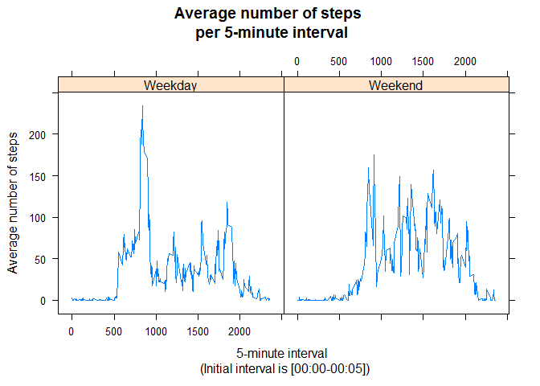

# Reproducible Research: Peer Assessment 1


## Loading and preprocessing the data
### 1. Load the Data
We first download the The data for this assignment  **"Activity monitoring data"** from the course web site to our current working directory. Then,  we read the raw data from the `.zip` file into the data frame `data`.


```r
if (!file.exists("activity.csv")){
  unzip("activity.zip")
}

data <- read.csv("activity.csv")
```
### 2. Process/Transform the Data
In order to tranform our Data into suitably applied data for our next stage (where the ``weekdays()` function will be used), we convert the date column into `POSIXct` format, (default time zone GMT).


```r
data$date <- as.POSIXct(data$date, tz="GMT")
```

## What is mean total number of steps taken per day?
### 1.Total steps taken per day
According to the instruction's indication, we can ignore `NA` values.The next step is to make a data frame containing the total number of steps for each day.


```r
StepsPerDay <- aggregate(data$steps, by = list(data$date), FUN=sum)
names(StepsPerDay) <- c("date", "totalsteps")
```
### 2. Histagram of the total Steps taken each day
Below, we illustrate a histogram of the total number of steps taken each day.


```r
hist(StepsPerDay$totalsteps, breaks=33, main="Histogram of total number of steps per day", xlab="Total steps per Day", col="green")
```

 

Since we calculate the total number of steps taken each day, we next calculate:

a) the **mean** of the total number of steps-per-day:


```r
mean(StepsPerDay$totalsteps, na.rm=TRUE)
```

```
## [1] 10766.19
```

and

b) the **median** of the total number of steps-per-day:


```r
median(StepsPerDay$totalsteps, na.rm=TRUE)
```

```
## [1] 10765
```

## What is the average daily activity pattern?

### 1. Time series Plot
In order to create the time series plot, we first make a data frame containing the average number of steps taken in every 5-minute interval, averaged across all days and removing NA values. 


```r
AVGStepsPerInt<- aggregate(data$steps, by = list(data$interval), FUN=mean, na.rm=TRUE)
names(AVGStepsPerInt) <- c("interval", "AVG_steps")
```

We make a time series plot of the 5-minute interval and the average number of steps taken, averaged across all days.


```r
plot(seq_along(AVGStepsPerInt$interval), AVGStepsPerInt$AVG_steps, type="l", main="Average number of steps per 5-minute interval", xlab="5-minute interval (initial interval is [00:00-00:05])", ylab="Average number of steps")
```

 

### 2. 5-minute interval contains  the MAx Number of steps ###

Below, we calculate which interval has the maximum number of steps on average accross all days.  


```r
which.max(AVGStepsPerInt$AVG_steps)
```

```
## [1] 104
```

Alternatively, we present the interval in a more proper format.


```r
leftIndex<-which.max(AVGStepsPerInt$AVG_steps)
rightIndex<-(leftIndex+1) %% dim(AVGStepsPerInt)[1] 
maxInterval <- paste("[", floor(AVGStepsPerInt$interval[leftIndex]/100), ":", AVGStepsPerInt$interval[leftIndex]%%100, "-", floor(AVGStepsPerInt$interval[rightIndex]/100), ":", AVGStepsPerInt$interval[rightIndex]%%100, "]", sep="")
```
Therefore, 
**the 5-minute interval with the maximum number of steps on average accross all days is [8:35-8:40] .**


## Imputing missing values
### 1. Total Number of NA

Below, we calculate the total number of rows having `NA`'s in the number of steps.


```r
sum(is.na(data$steps))
```

```
## [1] 2304
```

### 2. Filling the missing Values

Therefore, we replace each `NA` value with the average number of steps in the specific 5-minute interval, accross all days. The new created data frame is defined as `NoNAsdata`. 


```r
NoNAsdata <- data
NoNAsdata$steps[is.na(data$steps)] <- rep(AVGStepsPerInt$AVG_steps, times = dim(data)[1]/(24*60/5))[is.na(data$steps)]
```

### 3. New DataSet (including missing data)

In a similar analysis way, we make a data frame containing the total number of steps for each day using `NoNAsdata`.


```r
new_totalstepsPerDay <- aggregate(NoNAsdata$steps, by = list(NoNAsdata$date), FUN=sum)
names(new_totalstepsPerDay) <- c("date", "totalsteps")
```

Below, we make a histogram of the total number of steps taken each day.


```r
hist(new_totalstepsPerDay$totalsteps, breaks=33, main="Histogram of total number of steps per day without NAs", xlab="Total steps per Day", col="darkblue")
```

 

By performing the comparison of this histogram with the corresponding histogram for the original dataframe `data` in the y-axis, we can mark down some differences since there are a lot of `NA` values taken into account. 

### 4. The Impact of Imputing Missing Data

Therefore, using the total number of steps taken each day we calculate

a) the **(new) mean** of the total number of steps per day: 


```r
mean(new_totalstepsPerDay$totalsteps, na.rm=TRUE)
```

```
## [1] 10766.19
```
and 

b) the **(new) median** of the total number of steps per day:


```r
median(new_totalstepsPerDay$totalsteps, na.rm=TRUE)
```

```
## [1] 10766.19
```

In conclusion, the values for the mean in the processed data frame `NoNAsdata` ** is the same as in the original data frame `data`**(this is because we chose to replace `NA` values with the mean). The only different that we meet is references to the median from the case where the  `NA`'s not taken into account.

## Are there differences in activity patterns between weekdays and weekends?
### 1. Weekday(WD) or Weekend day (WenD)?

We create a new factor variable `weekday`, indicating whether a given date is a weekday or weekend day. 
To this direction, we use the `NoNAsdata` data frame.


```r
class_Day <-function(date){
  if (weekdays(date) %in% c("Saturday", "Sunday")){
    return("Weekend")
  } else {
      return("Weekday")
  }
} 

NoNAsdata$weekday <- sapply(NoNAsdata$date, class_Day)
NoNAsdata$weekday <- as.factor(NoNAsdata$weekday)
```

### 2. Panel Plot
in order to impliment the panel plot which  contains a time series plot of the 5-minute interval (x-axis) and the average number(AVG) of steps taken, averaged across all weekday days or weekend days (y-axis), we first:

find 
-  **mean number of steps accross all weekdays** and 
-  **accross all weekends**.


```r
AVGStepsPerIntAndWeekdayNoNA <- aggregate(data$steps, by = list(NoNAsdata$interval, NoNAsdata$weekday), FUN=mean, na.rm=TRUE)
names(AVGStepsPerIntAndWeekdayNoNA) <- c("interval", "weekday", "AVG_steps")
```


And finally, we impliment the panel plot presented below:


```r
library(lattice)
xyplot(AVGStepsPerIntAndWeekdayNoNA$AVG_steps ~ AVGStepsPerIntAndWeekdayNoNA$interval | AVGStepsPerIntAndWeekdayNoNA$weekday, type="l", ylab="Average number of steps", xlab="5-minute interval \n (Initial interval is [00:00-00:05])", main="Average number of steps \n per 5-minute interval", layout(c(1,2,1)))
```

 
